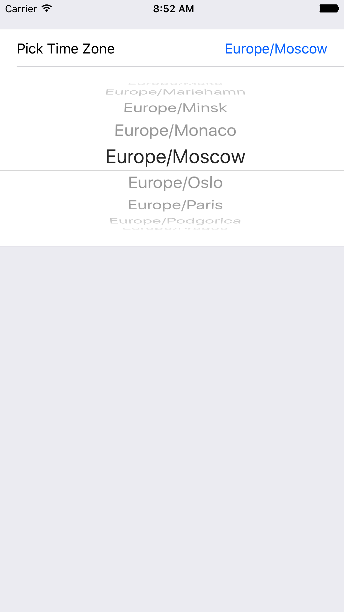

# TimeZoneInlineRow

[](https://travis-ci.org/yurevich1/TimeZoneInlineRow)
[](http://cocoapods.org/pods/TimeZoneInlineRow)
[](http://cocoapods.org/pods/TimeZoneInlineRow)
[](http://cocoapods.org/pods/TimeZoneInlineRow)


## Contents
* [Introduction](#introduction)
* [Usage](#usage)
* [Requirements](#requirements)
* [Getting involved](#getting-involved)
* [Examples](#examples)
* [Installation](#installation)
* [Customization](#customization)
* [LineRow parameters](#nativeexpressrow-parameters)

## Introduction

`TimeZoneInlineRow` is a simple time zone picker.

* Features
* Height setup



## Usage

Just setup a color.

`FormViewController`

```swift
import TimeZoneInlineRow

class ViewController: FormViewController {

override func viewDidLoad() {
super.viewDidLoad()

form +++ Section()
<<< TimeZoneInlineRow()  {
$0.value = TimeZone.current
}
}
}
```

## Requirements

* iOS 8.0+
* Xcode 8.3+

## Getting involved

* If you **want to contribute** please feel free to **submit pull requests**.
* If you **have a feature request** or you **found a bug** please **open an issue**.

Before contribute check the [CONTRIBUTING](CONTRIBUTING.md) file for more info.

## Examples

To run the example project, clone the repo, and run `pod install` from the Example directory first.

## Installation

TimeZoneInlineRow is available through [CocoaPods](http://cocoapods.org). To install
it, simply add the following line to your Podfile:

```ruby
pod "TimeZoneInlineRow"
```


#### CocoaPods

[CocoaPods](https://cocoapods.org/) is a dependency manager for Cocoa projects.

To install LineRow, simply add the following line to your Podfile:

```ruby
pod 'TimeZoneInlineRow', '~> 1.0'
```

#### Carthage

[Carthage](https://github.com/Carthage/Carthage) is a simple, decentralized dependency manager for Cocoa.

To install LineRow, simply add the following line to your Cartfile:

```ogdl
github "EurekaCommunity/TimeZoneInlineRow" ~> 1.0
```


## Customization

For basic styling colors initalization, use `cellSetup` and `cellUpdate`.

### TimeZoneInlineRow parameters

* `var value: String  = colorOfUIColorClass
* `var adHeight: Double`: sets your banner height.

For instance,

you can do this in any `FormViewController` class:

```swift
<<< TimeZoneInlineRow() {
$0.value = TimeZone.current
}
```


## Author

* [Petrukhin Vyacheslav](http://slava.online)


## License

TimeZoneInlineRow is available under the MIT license. See the LICENSE file for more info.


